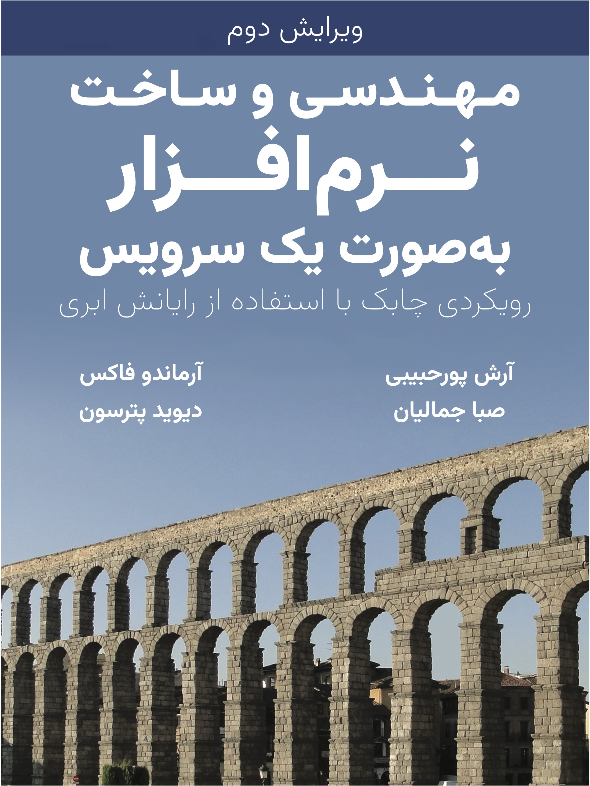

# مهندسی و ساخت نرم‌افزار به‌صورت یک سرویس: رویکردی چابک با استفاده از رایانش ابری

این مخزن با هدف انتشار نسخهٔ فارسی کتاب
"Engineering Software as a Service: An Agile Approach Using Cloud Computing"
ساخته شده است.
ترجمهٔ فارسی این کتاب تحت عنوان
«مهندسی و ساخت نرم‌افزار به‌صورت یک سرویس: رویکردی چابک با استفاده از رایانش ابری»،
با اجازهٔ رسمی نویسندگان آن
آرماندو فاکس
([Armando Fox](https://www2.eecs.berkeley.edu/Faculty/Homepages/fox.html))
و دیوید پَتِرسون
([David Patterson](https://www2.eecs.berkeley.edu/Faculty/Homepages/patterson.html))،
توسط
[آرش پورحبیبی](https://arash.pourhabibi.info)
و
[صبا جمالیان](https://www.saba.codes)
در حال آماده شدن است
و به‌صورت رایگان در دسترس عموم قرار می‌گیرد.

برای اطلاعات بیشتر می‌توانید به
[وبگاه اختصاصی ترجمهٔ فارسی](https://saasbook.info/translation-fa)
و همچنین
[وبگاه اصلی](https://saasbook.info)
کتاب مراجعه کنید.

## دریافت کتاب

ترجمهٔ فعلی بر اساس ویرایش دوم کتاب انگلیسی صورت گرفته است.
با توجه به اینکه این ترجمه در حال تکمیل (و همچنین دائماً در حال تصحیح) است،
ما برای ترجمه نیز شمارهٔ ویرایش مجزا در نظر گرفته‌ایم تا شما به راحتی بتوانید
تغییرات کتاب را دنبال کنید.
برای اطلاعات بیشتر در مورد ویرایش‌های کتاب و همچنین دریافت آخرین نسخهٔ کتاب
به صفحهٔ
[releases](https://github.com/neo-apz/saasbook-fa/releases)
همین مخزن مراجعه کنید.

## پیشنهاد‌ها و انتقاد‌ها

از شما دعوت می‌کنیم که پیشنهاد‌ها و موارد اصلاحی خود را حتماً با ما به اشتراک بگذارید.
برای این منظور، کافی است که به صفحهٔ
[issues](https://github.com/neo-apz/saasbook-fa/issues)
در همین مخزن مراجعه کنید و یک
issue
جدید ایجاد کنید و ما در اولین فرصت آن را مورد بررسی قرار خواهیم داد.

## حق نشر

حق نشر این اثر برای نویسندگان و همچنین مترجمان آن محفوظ است. شما آزاد هستید که از
این مطالب کپی دیجیتال یا چاپی برای استفاده شخصی خود تهیه کنید. شما نمی‌توانید بدون
اجازهٔ صریح صاحبان حق نشر، این مطالب را به‌صورت دیجیتال یا چاپی،
خواه برای نفع مالی یا نه، توزیع مجدد کنید.